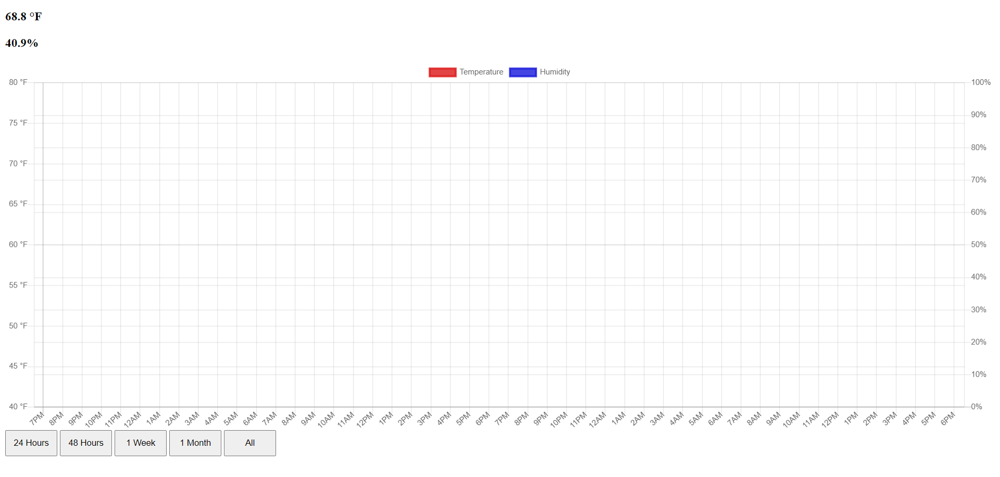
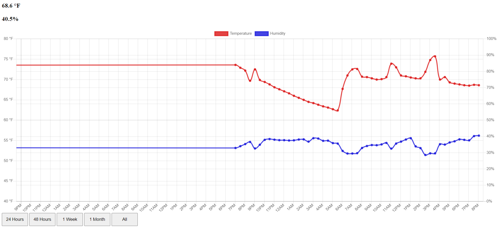

# Temperature Monitor
This is the source code for a website that gets data from the SI7021 I2C Humidity and Temperature Sensor and displays it on a graph.
The server runs on a Raspberry Pi Zero W.

### Images

